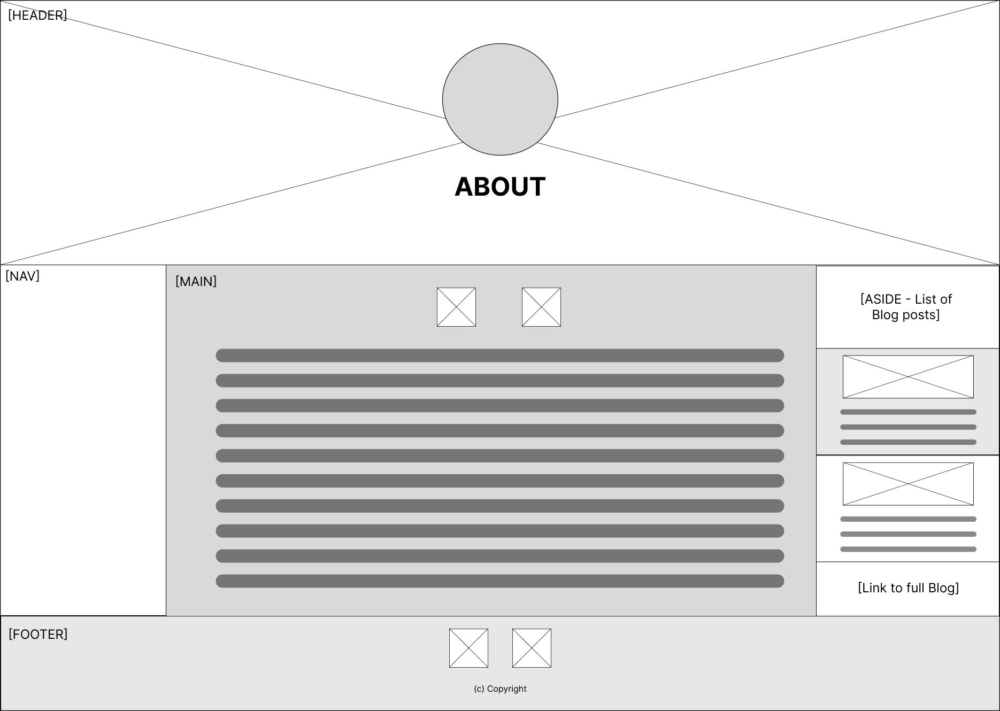

# T1A2 Project:  Plan & Develop a Portfolio Website

**Author:** Jessica Jakeman

**Date Created:** 7 April, 2024

## Project Source Files

All files pertaining to this project can be found in the following GitHub repo:

- [Portfolio-Website](https://github.com/jeskaj/Portfolio-Website)

## Website Description

### Purpose

The purpose of this website is to showcase my skills, talents, abilities and coding experience, in order to introduce myself to potential employers as a skilled web developer and IT professional.

### Website Structure

My portfolio has a relatively simple structure, consisting of two levels only, as shown in the sitemap below:

1. First level: Home page only
2. Second level pages:
    1. About
    2. Portfolio
    3. Blog
    4. Contact

#### Navigation

Every page contains a navigational component to enable all other pages to be accessed directly.  On the Home page, this takes the form of prominent navigational button-like anchor elements featured in the mid section of the page.  All other pages contain a nav bar, directly under the header component on smaller layouts and as a sidebar in larger layouts.

The nav bars show the link to the current page in a darker colour, to indicate the user's current location.

The About page contains a list of blog posts, which link directly to the relevant articles on the Blog page.

The only other internal document linked to the site is a PDF of my resume, which is linked to the About page.

#### External links

Links to my professional social media profiles ([LinkedIn](https://www.linkedin.com/in/jessica-jakeman/) and [Github](https://github.com/jeskaj) - see screenshots below) are included in the footer of every page, except for the Contact page, which features them more prominently in the main section.

<figure>
    <figcaption>LinkedIn Profile page</figcaption>
    
</figure>

<figure>
    <figcaption>GitHub Profile page</figcaption>
    
</figure>

Each Project on the Profile page contains a link to the relevant repository within my Github profile.

<figure>
    <figcaption>IMA Zebra project GitHub repository page</figcaption>
    
</figure>

<figure>
    <figcaption>Cute Puppy project GitHub repository page</figcaption>
    
</figure>

<figure>
    <figcaption>Chess Board project GitHub repository page</figcaption>
    
</figure>

### Design

#### Wireframes

*Home Page layouts for mobile and tablet:*

*Home Page layout for desktop:*

*About Page layouts for mobile and tablet:*

*About Page layout for desktop:*

*Portfolio Page layouts for mobile and tablet:*

*Portfolio Page layout for desktop:*

*Blog Page layouts for mobile and tablet:*

*Blog Page layout for desktop:*

*Contact Page layouts for mobile and tablet:*

*Contact Page layout for desktop:*

**[REMOVE THIS:]**
Explain: Your decision making process relating to the overall aesthetic of your website

Mountain hero image - calming (desirable quality in a professional), reflects my love of nature

Other colours chosen to blend in with and complement the mountain hero image

### Functionality & Features

This structure and content of this site was written in HTML and styled with CSS (including SASS/SCSS).

The site comprises the following **components**:

*** ADD MORE ABOUT HOW STYLING WILL ENGAGE THE AUDIENCE ***

#### Header (Hero Unit)

Each page contains a Header component / Hero unit at the top.  All headers include:

- Background image - setting the asthetic of the site
- Headshot image - to introduce me to the audience
- Title of page heading - in large text to make the purpose of the current page clear

The semantic tag `<header>` has been used to indicate that this component appears near the top of the page and contains important information about it.

The primary purpose of the Header is to introduce the page to the user and make its purpose clear.

In the case of the Home page, it also communicates my full name and states my current role, via a short line of text under the heading, introducing me as a web development student:

*Web development student at Coder Academy*

The Header also provides visual interest to the page, via the background image and headshot.  On tablet and desktop views, it also provides visual balance to the page, offsetting the footer (which has a background colour chosen from the header image).

#### Navigational Bar (Nav)

The purpose of the Nav is to provide the user with clear and simple navigation throughout the site.

The semantic tag `<nav>` has been used to indicate that this component is a navigational bar containing links to other pages within the site.

On the Home page, the Nav includes links to the four second level pages:

1. About
2. Portfolio
3. Blog
4. Contact

The Home nav features four rectangular button-link links which clearly stand out and has three layout designs for different screen sizes:

The mobile view has the links vertically stacked, to fill the screen space:

The table view is a 2 x 2 grid, to better fill tablet proportions:

The desktop view moves to a 4 x 2 grid with the links appearing in odd numbered spaces, producing checkerboard-type effect, to better fill desktop proportions:

On all second level pages, the Nav includes links to all of the five site pages, including Home:

1. Home
2. About
3. Portfolio
4. Blog
5. Contact

Due to the limited horizontal space available in portrait mobile views, the mobile nav bar is horiztonal, appearing below the header:

Ihe table and desktop views, the nav becomes a sidebar, to make better use of the increased horiztonal space:

#### Main Section (Second Level Pages)

The purpose of the Main section on the second level pages is to contain the primary information the page has been created to communicate, ie:

- About:  Information about my skills, experience and interests, including a link to my resume
- Portfolio:  Information about my recent projects
- Blog: Blog articles I have written
- Contact:  My contact information

The semantic tag `<main>` has been used to indicate that this component contains the main content the page.

The Home page does not contain a Main section, as, aside from introducing my name and role (which is done by the Header), it's main function is a to be a landing page allowing the user to quickly navigate to other site pages.  Therefore, the Nav occupies the middle section / primary real estate of the Home page.

#### Aside (About Page)

The purpose of the Aside is to be a container displaying a list of the blog posts with links to the full articles on the Blog page.  It appears on the About page, as the blog posts I have written further demonstrate my experience, skills and interests.

The semantic tag `<aside>` has been used to indicate that this component contains additional information, aside from the main page content.

The Aside contains multiple blog post summary elements, each of which is a component in it's own right and contains a summary of a blog post.  Each post listing contains an image for visual interest, in addition to title, date published, a brief summary sentence and a direct link to the full blog post.

Due to limited horizontal space on mobile layouts, the Aside appears underneathe the Main section.

On tablet and desktop layouts, to make better use of available horizontal space, it appears on the right hand side of the screen next to the Main section.  In this way, it is more prominent to the user's attention and also provides some visual balance to the Nav bar on the left side of the main section.

#### Project Sections (Portfolio Page)

Project sections appear within the Main section of the Portfolio page.

The purpose of the Project sections is to demonstrate my technical skills by displaying my recent projects for potential employers to review.

The semantic tag `<section>` defined with `class="project"` has been used to indicate that this component is a section within its parent element that contains information on a project.

Each project section comprises:

1. The project name
2. A link to the project's Github repository - to enable viewers to view the full project and review my code
3. A project brief - a short description of the project's purpose
4. A project image - to give some idea of the project's appearence / end result and also to provide visual interest and draw the user's attention

#### Blog Post Articles (Blog Page)

Blog Post Articles appear within the Main section of the Blog page.

My site includes a Blog to further demonstrate my experience, skills and interests.

The purpose of each Blog Post Article is to contain a full blog post. The semantic tag `<article>` has been used for blog posts as each post is a self-contanied article that could be reused elsewhere, independent of other content on the Blog page.

Each Blog Post Article comprises:

1. An image - relevant to the blog topic and to draw user attention
2. Blog post title - to make clear the subject of the post
3. Date published - to give context regarding when the post was written
4. The text of the blog - the full article

#### Footer

The purpose of the footer is to display the site's copyright information on every page and to provide links to my social media profiles (if not otherwise provided in the main section of the page).

The semantic tag `<footer>` has been used to indicate that this component contains the footer content and appears at the bottom of the page.

On the tablet & desktop layouts, where height is restricted to the viewport height, the footer has a lighter background colour (chosen from the header image), distinguishing it from the main section of the page and also providing visual balance, as an offset to the header.

Footer in mobile layout  

Footer in table layout  
